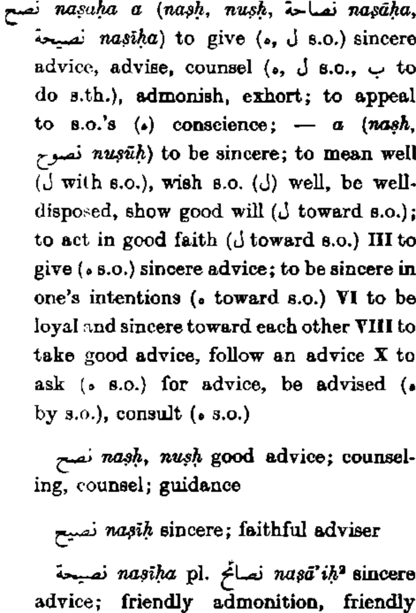
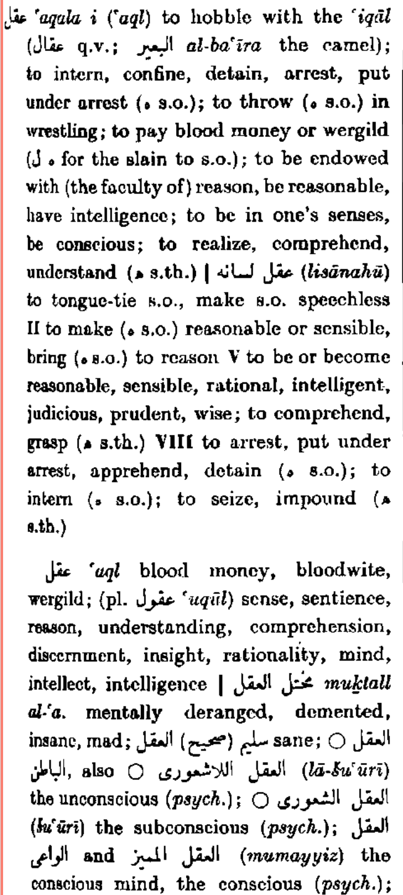
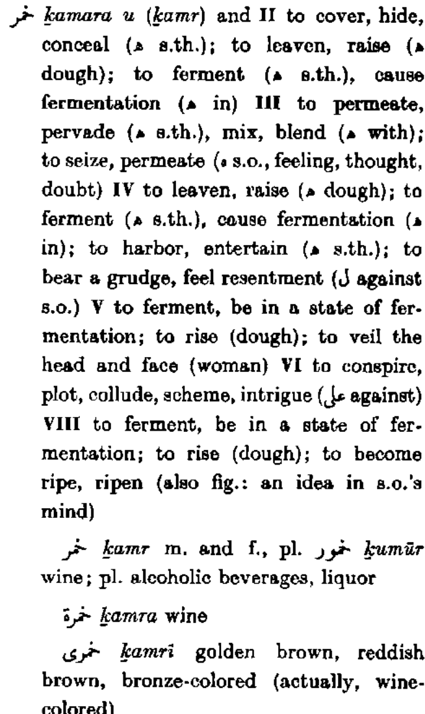

# (PART) دروس الإسلام {-}

# تربيّة{#tarbiyya}

## فوائد

### Qari Mohammad Sayed Siddique Ahmad Bandwi {#qari-siddique}

Qari Siddique Bandwi was born in Baanda, India in 1919 [@bundelkhand]. He was of such character and piety that when sheikh Abdul Fattah, a renowned Syrian scholar, asked Maulana Shabiq (the principal of Darul Uloom Zakariyya) about awliyah he could visit, Maulana Shabiq referred Qari Siddique Bandwi. Sheikh Abdul Fattah traveled all they way to the small city of Baanda to visit him.

Another incident regarding Qari Bandwi is when he was collecting donations for a madrasa in baanda. He was taking the train home late at night in the remote village, bringing with him the bag of funds he collected, when a group of thieves stopped him and staged a stick up. They told him to leave the money, but Qari Bandwi said he can't give the money since it did not belong to him. The thieves did not care and wanted the money anyway, so Qari Bandwi threw them the bag and said, "let's see how far you go." The next day, someone came to Qari Bandwi and said there are people in the city looking for him. It was the robbers; they were unable to make their escape ― it was like there was an invisible barrier preventing them from leaving the city.

### The concept of فيض

> **فيض**  
> *Hans Wehr* flood, inundation, deluge; emanation; superabundance, plenty, copiousness, abundance; stream  
> *معنى إصطلاح* The internal Nur, from a heart

Abu Bakr, one of the awliyah in Chicago, had said (paraphrased), "There are two steps for a Mu'min to take. The first step is to squash the nafs, the second is to enter paradise. I have taken the first step, and I am waiting for the second."

He had also said "The one who cannot benefit from the silence of the Ulamah will not benefit from their speech."

This is the concept of فيض. It is the moment when Angel Jibreel hugged Nabi ﷺ tightly in the cave of Hira. It is the feeling of spiritual rejuvenation felt in the presence of the awliyah. It is part and parcel to why the Islamic tradition emphasizes attainment of knowledge from scholar to student in an intimate manner, where knowledge is not just information but an exercise in connecting heart-to-heart. We hope and pray that in this manner, by staying close with those who are close to Allah ﷻ, we too can get closer to Allah ﷻ.  
One of the scholars would invite the students to his house from Asr to Maghrib, and offer them tea. They would not say anything in that time, just sit and do Adhkar. Just by sitting in the presence of the scholar, the students could find benefit in their own spiritual growth.

### Miracles

In the story of the theives and [Qari Siddique Bandwi]{#qari-siddique}, the supernatural incident where the thieves were unable to leave the city due to an invisible barrier they felt is an example of a *كرامة*.  
**معجرة** is the supernatural phenomenon for a prophet. إعجاز is literally something inimitable and wondrous. For example, Rasulullah ﷺ splitting the moon, or Musa (AS) splitting the sea.  
**كرامة** is where a supernatural incident happens at the hands of a wali of Allah ﷻ. It honors the wali and proves their nearness to Allah ﷻ. Every كرامة is a معجرة of their prophet because they would not happen without the wali following the sunnah of their prophet.

**إرحاص** a supernatural phenomenon done by a kuffar to deceive others.  
**إستدراج** a supernatural phenomenon that deceives oneself. It is literally to get reeled in. For example, fir'aun seeing the sea split believed that it was his ability that led to the sea being split, but it was not his ability, it was Musa (AS). By fooling himself, fir'aun found greater conviction in his ضلال.

إستدراج is extremely important for us to be aware of. درج means levels, and إستدراج works in levels, step by step people fall of the deen. For example, if someone is doing da'wah on youtube, and they start to gain a significant following, to be wary of إستدراج means to realize that the popularity could be a test of one's ego.  
We see this wariness among the Sahaba. During the khilafa of Umar (RA), he saw the Masjid filled with gems, and gold, and riches. The Muslims were joyful, but Umar (RA) was sad. He asked if this was a blessing, why was it not given to Rasulullah ﷺ or Abu Bakr (RA)? He realized that the blessing given to him and the Muslims was a test.  
Another example is Sulaiman (AS). The ayah in the Qur'an discusses this (27:40):

> قَالَ ٱلَّذِى عِندَهُۥ عِلْمٌ مِّنَ ٱلْكِتَـٰبِ أَنَا۠ ءَاتِيكَ بِهِۦ قَبْلَ أَن يَرْتَدَّ إِلَيْكَ طَرْفُكَ ۚ فَلَمَّا رَءَاهُ مُسْتَقِرًّا عِندَهُۥ قَالَ هَـٰذَا مِن فَضْلِ رَبِّى لِيَبْلُوَنِىٓ ءَأَشْكُرُ أَمْ أَكْفُرُ ۖ وَمَن شَكَرَ فَإِنَّمَا يَشْكُرُ لِنَفْسِهِۦ ۖ وَمَن كَفَرَ فَإِنَّ رَبِّى غَنِىٌّ كَرِيمٌ

> Said one who had knowledge of the Book: "I will bring it to thee within the twinkling of an eye!" Then when (Solomon) saw it placed firmly before him, he said: "This is by the Grace of my Lord!- to test me whether I am grateful or ungrateful! and if any is grateful, truly his gratitude is (a gain) for his own soul; but if any is ungrateful, truly my Lord is Free of all Needs, Supreme in Honour!" 

In summary, whenever there is a fadhal from Allah ﷻ, we should be grateful and aware that these things are a test.

### Difficulties in memorizing

Imam Zaid Shakir said that when joined Madrasa, he was about 29. He spent an entire day memorizing the first line of his Nahw lesson. At the end of the day, he found that he forgot that single line he spent the entire day memorizing. He spent days and days on that single line.  
It takes time to learn and memorize, and there will be times where it seems difficult or even impossible. But it is important to remember that Allah ﷻ chose us to be here, and it is by his will that we remember anything and his will that we forget, and we just need to put our most sincere and best effort forward in hopes that He will accept our efforts.

## أحاديث

### Intentions

See [the section in the home page](#intent) for a more general discussion on intention.

It is of utmost importance to be sincere in our intentions. Through a noble intention, a small action becomes heavy in the scales, and through a bad intention a huge action becomes light in the scales. 

tamlul mizan - scales are by weight, not number

### حديث ١

#### حديث

> الدين النصيحة

> The Religion (Islam) is to act with sincerity (_Muslim_)

Click here to view Hans Wehr definition for نصح

#### الخلاصة لزاد الطالبين

The word _nasiha_ is a difficult word to translate into English. It encompasses many things such as

- acting with sincerity and honesty 
- giving good advice
- enjoining towards good
- desiring good

#### الخلاصة لخطبة المفتي

##### Hadith commentary

The word نصح:

1. نصحة الثوب a man sewing his clothes
2. نصحة العسل to purify honey from wax

What is the connection between these and well wishing? For 1, if there is a tear in clothes, you tie and sew it to fix it and make it whole and beautiful again. The Deen is like this for tears in relationships between people.  
The ال on نصيح makes it a صفة, it tells us the significance of it. You cannot be on the Deen without being a well wisher.  
According to the _ulama_, this Hadith constitutes $\frac{1}{4}$ of Deen. Imam Nawawi said this is 100% of Deen.

The the rest of the Hadith, the sahaba ask Rasulullah ﷺ "لمن?" Rasulullah ﷺ said "For Allah ﷻ, His Book, His Messenger, the leaders of the Muslims, and the common people."

This Hadith is structured with a purposeful order to the entities to which نصيحshould be given to.

1. For Allah ﷻ

This means to obey and believe in Allah ﷻ. 

2. For His Book

This means to believe in the Qur'an and that no one but Allah ﷻ revealed it. It means to recite it as it is meant to be recited and to heed the messages it tells us.

3. For His Messenger

This means to honor him before and after his life, to replicate his Sunnah, to defend and love him and his family and his companions

4. For this leaders of the Muslims

This refers to the Muslim government and the scholars, since both are leaders of the Ummah (although a khalifa does not exist in the present day). This means to obey them and assist them, and to gently guide them when they make mistakes. Just like the blind spots of a car that are covered by the rear view mirrors, the Muslims should be covering the blind spots of their leaders. It also entails not demanding anarchy and encouraging Muslims to follow their leaders (protest, when justified, is warranted, but unwarranted rebellion and intentionally causing dissent is not).  
Also, given the order of things the Hadith conveys, obeying Allah ﷻ is more important than anything else, so if there is something the leaders are asking of the people are asking that is against the Deen, it is more important to obey Allah ﷻ.

##### The etiquette of giving and receiving advice

1. Ikhlaas

Advice should be given out of sincerity, not with the intention to disgrace. To be a well wisher means to not call people out in a bad way, to tell them privately, to talk with sincerity and gently. It also entails starting from a soft place, a place of friendliness. It is never a good idea to be uncongenial and caustic in how we approach people, even with the intent of correcting someone. When a cook would cook in the past, it would take a long time to start the fire, and short time to cook the meat.

For example, there was a time when Rasulullah ﷺ was praying Salah, and before he got up from Rukuhsomeone ran to join the Saff and said Allahuakbar while running to catch the Ruku. Rasullah ﷺ tells him "May Allah ﷻ increase you, but don't repeat this mistake." He ﷺ begins with praise and recognizing the good intent in the Sahabi that he had so much desire to catch the ruku.

2. Don't hide naseeha

Nabi ﷺ said there are 6 rights of a Muslim on another. One of them is to give advice whenever he asks for advice. If someone asks about a person for marriage, or a school, or a business they are interested in, etc., and they come to consult you because you have some experience or expertise, you should give the full advice. If it is related to a person, such as about a person with the intent of marriage, you can speak without backbiting by saying something like "it's not a good match." There's no need to give detailed reasons if it leads to backbiting.

3. Giving naseeha in a proper manner

As mentioned above, gentleness when giving advice is essential. Leave out harshness and hardness and use wisdom in how you approach or respond to a person. In Surah Naml, ayah 125:

> ٱدْعُ إِلَىٰ سَبِيلِ رَبِّكَ بِٱلْحِكْمَةِ وَٱلْمَوْعِظَةِ ٱلْحَسَنَةِ ۖ وَجَـٰدِلْهُم بِٱلَّتِى هِىَ أَحْسَنُ ۚ إِنَّ رَبَّكَ هُوَ أَعْلَمُ بِمَن ضَلَّ عَن سَبِيلِهِۦ ۖ وَهُوَ أَعْلَمُ بِٱلْمُهْتَدِينَ

> Invite (people) to the way of your Lord with wisdom and good counsel. And argue with them in the best of manners. Surely, your Lord knows best the one who deviates from His way, and He knows best the ones who are on the right path.  
> Mufti Taqi Usmani

4. Give advice in secrecy/privately

Imam Shafi has a poem:

> If you want to give me advice,  
> give it in private  
> Because advice in public is reprimanding

### حديث ٢

#### حديث

> الدعاء مخ العبادة

> Supplication is the essence of worship (_Bukhari_)

#### الخلاصة لخطبة المفتي

Begging Allah ﷻ means you are a believer. Why would you knock on a door when you know no one's there? As Iman grows, the duas become longer and more sincere, since it reflects conviction in Allah ﷻ.  
If you were on a TV show were they give you the option of 5, 10, or 20 minutes to grab anything you want from Best Buy for free, would you choose 5 minutes? Of course, to grab as much as possible, one would choose 20 minutes. It is foolish to pick less time if you are aware there is a reward.

Dua begins with praise of Allah ﷻ, e.g. through Al-Fatihah, duas from the morning & evening duas booklet, or names of Allah ﷻ. Then, we make salawat. We begin with issues we are facing acutely, such as in the moment or in the 1-year program, then ask for the future, then for parents, teachers, family, classmates, etc. then we ask for our entire life, the grave, the afterlife. Finally, we end with salawat and praise of Allah ﷻ. 

### حديث ٣

#### حديث

> المرء مع من أحب

> A person will be with whom he loves (_Bukhari, Muslim_)

#### الخلاصة لخطبة المفتي

According to Anasؓ, there was no day happier after accepting Islam than when this Hadith was revealed.  
A Sahabi came to Rasulullah ﷺ complaining, that 'When I am with you I feel good, but once I leave you I lose myself until I come running back to you. How will I be once you pass away? Your level in Jannah will be so much higher, I will never see you again.' Rasulullah ﷺ was silent for a bit, and then the ayah was revealted,

> 

According to a poem, "Love the pious, for even if you are not amongst them inshallah Allah will grant you piety."

### حديث ٤ 

#### حديث

> الأناة من الله و العجلة من الشيطان

> Calmness and patient deliberation is from Allah ﷻ and haste is from Satan (_Tirmidhi_)

#### الخلاصة لخطبة المفتي

We attribute all good to Allah ﷻ. We should hurry to do good Deen, as this type of hurry is not from Shaytaan. Our niyyah must be correct — to hasten towards good, but to be calm and collected while doing good.

An example of hastening incorrectly is in context of marriage. It is a huge decision, so one should not rush into it. Decisions like these should not be based on the immediate need, and requires thought about the future, especially with respect to how it will affect our Deen, our afterlife, and our progeny.

In the surah Isra ayah 11, عجلة is used to show how we hasten towards evil.

> وَيَدْعُ ٱلْإِنسَـٰنُ بِٱلشَّرِّ دُعَآءَهُۥ بِٱلْخَيْرِ ۖ وَكَانَ ٱلْإِنسَـٰنُ عَجُولًا

> Man prays for evil like his prayer for good, and man is so hasty.  
> Mufti Taqi Usmani

### حديث ٥

#### حديث

> المجالس بالأمانة

> Gatherings are to be kept in confidence (_Abu Dawud_)

#### الخلاصة لخطبة المفتي

What happens in a _majlis_ stays in the _majlis_. Any private conversation **must** be kept secret. The only possible exception is where someone says they are going to do something to harm themselves or the Ummah, in which case you must do what you can to get them help or prevent the evil from happening, if there is intent for evil.

### حديث ٦

#### حديث

> الحياء شعبة من الإيمان

> Modesty is a branch of faith (_Bukhari, Muslim_)

#### الخلاصة لخطبة المفتي

ما عندنا خطبة لهذ الحديث

### حديث ٧

#### حديث

> الخمر جمّاع الإثم

> Alcohol constitutes many sins (_Razin_)

#### الخلاصة لخطبة المفتي

Click here to view Hans Wehr definition for عقل

  

Click here to view Hans Wehr definition for خمر

  
عقل (reason, rationality) ties you from doing wrong and harmful things. When drunk, the mind is unable to make decisions. خمر is a shroud or a cloak, it masks عقل and covers the mind. It releases the restrictions on doing haram and evil actions.  
A person is asked, would you murder? He responds, "No." Would you commit Zina? "No." Would you steal? "No." Lie. "No." Eat Haram? No." Drink? "Sure." The man drinks, then commits all of the above.  
خمر is any intoxicant that alters the mind.

### حديث ٨

#### حديث

> المؤمن غرّ كريم والفاجر خبّ لّئيم

> A believer is simple and noble and a transgressor is deceitful and ignoble (_Abu Dawud, Tirmidhi_)

#### الخلاصة لخطبة المفتي

If someone is at an airport, and the for Salah comes and he pays extra for a janimaz. He knows he is getting ripped off, but he does not mind since he desires to pray on a janimaz. It seems like he is getting deceived, but in reality he has higher priorities for which he sacrifices for, just like if a person was starving and offered food for an exorbitant price, he would pay the price for his survival.  
There are also people who seem like they are getting deceived, but in reality are generous. In another Hadith, it comes that a believer does not get bit twice from the same hole, but this is not applicable to deliberate generosity, where a person knows he is getting deceived but continues to give out of generosity.

### حديث ٩

#### حديث

> الظلم ظلمات يوم القيامة

> Oppression will be darkness on the Day of Judgement (_Bukhari_)

#### الخلاصة لخطبة المفتي

Believers will have noor rushing in front of them. Oppressors and disbelievers will have layers of darkness. An "oppressor" is a general term for someone that takes the right of something else. It is better to be the oppressed than the oppressor.

What is ظلم?

> **ظلم** — وضع شىء في غير محله  
> Putting something in the wrong place

For example, putting your glasses on your feet, or your shoes on the desk.

ظلم can be done to oneself. People were put on earth for a reason, so to go against it is ظلم. The limbs have certain purposes for which they were given to us, so to use them for sinning is ظلم since that is not the reason for which they were created. Furthermore, by committing sins, one oppresses oneself by putting themselves into hell.  
There is no greater ظلم than shirk, however. No matter how many rights of the people are transgressed, the worst ظلم is to deny Allah ﷻ or His oneness since that is a transgression of His rights.  
In humanism, it is often claimed that all that matters is how we treat others and social justice. But no one cares if you are praying. This is ظلم to yourself and to Allah ﷻ.

### حديث ١٠

#### حديث

> الدنيا سجن المؤمن وجنّة الكافر

> The world is a prison for the believer and a paradise for the disbeliever (_Muslim, Tirmidhi_)

#### الخلاصة لخطبة المفتي

A non-Muslim cobbler is sitting on a street, while a scholar on a fancy horse comes by. The cobbler says something under his breath, so the scholar turns around and inquires, "What did you say?" The cobbler says, "You don't even follow what your Prophet is saying," and he quotes this Hadith, and continues, "look how rich you are and how poor I am. You're living in a Jannah while I live in a prison." The scholars ponders and responds,

1. If I die in the state of Iman and Allah ﷻ is pleased with me, then the paradise that awaits me is so luxurious that the life on earth will be so terrible in comparison it will seem like a prison. If you disbelieve, then even if life on earth is terrible, Jahannum will be so much worse.
2. A believer is in a prison because he is not free to do what he wants. Prison has a warden, you sleep when you are told, eat what you are told to eat, do what you are told to do. Every aspect of life is controlled. Life outside the prison is free — a kafir can do whatever, nothing will stop him because he does not believe in the consequences and accountability in the eyes of Allah ﷻ.

### حديث ١١

#### حديث

> اليد العليا خير من اليد السفلى

> The upper [giving] hand is superior to the lower [taking] hand (_Bukhari, Muslim_)

#### الخلاصة لخطبة المفتي

Giving is much better than taking. If bringing a gift for an elder, it should be given with the hand under the gift.  
When giving, do not mention the favors you have done for them; do not count favors. Do not give something then start saying stuff like, "Remember how I gave you this this time and that that time."

### حديث 

#### حديث

> 

> 

#### الخلاصة لخطبة المفتي

### حديث ١٣

#### حديث

> الجرس مزامير الشيطان

> Bells are the flutes of Satan (_Muslim_)

#### الخلاصة لخطبة المفتي

Some South African car jackers were interviewed once, "How do you commit such atrocious murders and evil deeds?" They said we take drugs. It alters their mind, which enables them to do extremely evil action.  
When the Saudi government conspired to kill Jamal Kashari, they set up an elaborate plan to remove accountability. In the end, the murderer was identified, and when he was asked how he could do something so atrocious as sawing off the limbs of Jamal as he died, he said "I just put music on and zoned out, and did my job."

When Rasulullah ﷺ would recite Quran, people would say this is so beautiful it could not have been written by a man but a greater being. Music is so evil, it is like it is written by the devil himself.

### حديث ١٤

#### حديث

> الطعام الشاكر كالصائم الصابر

> The one who eats and is thankful is like the one who fasts and is patient (_Tirmidhi, Darimi_)

#### الخلاصة لخطبة المفتي

Do not feel guilty for having material things, instead do shukr. Do not feel envious for not having material things, instead be patient.

- فتنة السراء fitnah of سرور, happiness
- فتنة الضراء fitnah of difficulty

One day, Umarؓ comes to the masjid and he sees wealth, gems and gold reaching the roof of the masjid. A sahabi sees him and says are you not happy? Umarؓ responds, "No, I am really worried I cannot imagine this wealth is good for us. I cannot imagine this wealth is good if it was given while I am Khalifa and not in the time of the Khilafa of Abu Bakrؓ. I cannot imagine it is good if it was given to us and not during the time of Rasulullah ﷺ."

Perhaps the good we are given in this world, should we not be grateful for it, will only take away what reward we would have gotten in the Akhirah. In surah Ahqaf ayah 20, Allah ﷻ says:

> وَيَوْمَ يُعْرَضُ ٱلَّذِينَ كَفَرُوا۟ عَلَى ٱلنَّارِ أَذْهَبْتُمْ طَيِّبَـٰتِكُمْ فِى حَيَاتِكُمُ ٱلدُّنْيَا وَٱسْتَمْتَعْتُم بِهَا فَٱلْيَوْمَ تُجْزَوْنَ عَذَابَ ٱلْهُونِ بِمَا كُنتُمْ تَسْتَكْبِرُونَ فِى ٱلْأَرْضِ بِغَيْرِ ٱلْحَقِّ وَبِمَا كُنتُمْ تَفْسُقُونَ

> And the day the disbelievers will be presented before the Fire, (it will be said to them,) “You have consumed your good things in your worldly life, and have enjoyed them. So, you will be punished today with the torment of humiliation for the arrogance you used to show on earth with no right (to do so), and for the sins you used to commit.  
> Mufti Taqi Usmani

Rasulullah ﷺ said, 'I am not worried about poverty, I am worried about wealth (referring to the Ummah) because people will compete in amassing wealth.'

We sympathize with everyone besides ourselves because they are dealing with death, poverty, and destruction, but we don't realize the test given to us is just as difficult.

### حديث 

#### حديث

> 

> 

#### الخلاصة لخطبة المفتي
