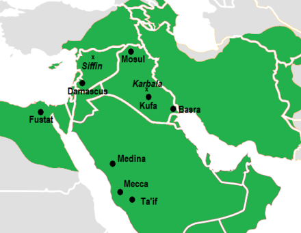

# عقيدة{#aqeedah}

## Introduction to علم الكلام

### Introduction to عقيدة

> **عقيدة**  
> Theology; the basic tenets of Islam; beliefs required to have *iman*.

> **علم الكلام**  
> *معنى لغة*: Discursive/dialectic theology; *literally* knowledge of speech  
> *معنى إصطلاح*: rationally proving the beliefs delineated in عقيدة and disproving erroneous beliefs.

علم الكلام was not a science created during the time of the Prophet ﷺ. It was developed in the centuries following early Islam and continues to today as a science that rationally grounds us in our beliefs and simultaneously helps remove doubts.

### Syllogisms and rational arguments{#syllogism}

What is a rational argument? A rational argument is an argument that employs logic to infer a conclusion given specific assumptions.

An example of a rational argument is a *syllogism*, which begins with an overarching premise to determine properties of something specific. A syllogism is composed of three statements: two premises, which are assumed to be true and share a common term, and an inference that logically arises. In this way, by comparing observations greater statements can be made. For example,

1. All tigers are 4-legged creatures
2. All 4-legged creatures are animals
3. All tigers are animals

Syllogisms come in two types, *universal* and *particular*. Depending on the specific type of logic employed, a syllogism can be either *deductive* or *inductive*. Classically speaking, a deductive argument uses a generalization, then applying it to something specific. An inductive argument begins from the observation or specific and generalizes those observations to a theory.

Syllogisms originated in Greek rhetoric, but found its way into Islam and علم الكلام when the Muslims conquered Roman lands. An example of how a deductive (i.e. universal) syllogism might be applied is:

1. Everything that exists must have a cause for its existence
2. The universe exists
3. The universe has a cause for its existence

#### Silly syllogisms

Syllogisms must be *valid* and *sound*. To be valid, the syllogism must have the proper format (i.e., 3 clauses, as well as certain logic applied in each clause that is beyond the scope of these notes). To be sound, the statements must be valid *and* the clauses must actually be true. When syllogisms are not sound, there are some interesting results:

1. All chimpanzees are cosmonauts
2. Some asteroids are chimpanzees
3. Some asteroids are cosmonauts

In this syllogism, the logic is valid, but the clauses are *not* sound. This is easy to disprove: since it begins with a universal statement, one existing counterexample would suffice. So, if you find a chimpanzee that is not a cosmonaut, then the rest of the argument is not true.

For more silly syllogisms, [click here](http://krypton.mnsu.edu/~jp5985fj/courses/609/Logic/Silly%20Syllogisms.htm).

### بدعة   

#### Definitions

> **بدعة**  
> *معنى لغة* to produce something without any prior material. For example, بَدِيعُ ٱلسَّمَـٰوَٰتِ وَٱلْأَرْضِ translates to He (الله ﷻ) is the originater of the heavens and the earth  
> *معنى إصطلاح* innovation without any source in Shariah

> **بدعة عملية** practical innovation; innovation in actions  
> **بدعة إعتقادية** theological innovations. For example, denying man's free will.

#### اهل السنة vs اهل القبلة

اهل السنة are the mainstream, sunni orthodox Muslims. اهل القبلة are those that are within the fold of Islam, but not considered Orthodox Sunni.  
Generally speaking, بدعة إعتقادية is more likely to cause one to leave the fold of _Ah -as-Sunnah wal-Jama'a_ and _Ahl al-Qiblah_, but there are egregious بدعة عملية that will also cause one to leave _Ahl as-Sunnah_ and _Ahl al-Qiblah_ (for example, praying 4 rakat for _Maghrib_).

### The origin of علم الكلام

Islam began in _hijaz_, a vast expanse of land sparsely occupied by nomads. Compared to the extremely wealthy nations surrounding the peninsula ([see Seerah for more info](#seerah)), _hijaz_ was relatively lacking in diverse philosophical ideologies. This is because the mixing of culture (and, through necessity, ideology) and subsequent diversity in culture requires frequent interaction with cultures disparate from one's own, but for centuries the Arabs lived alone and untouched, without war or wealth to stimulate cross-cultural dialogue.

This was the setting in which Islam was revealed, and it was not until the time of the Khalifa of Umar ibn al-Khattab ؓ that the Muslims began deeply interacting with other cultures as lands were conquered. The codification of علم الكلام truly began when _bayt al-hikmah_ was established in Baghdad in 200 AH, and Greek works in logic, geometry, medicine, and philosophy were translated into Arabic.

The inculcation of useful methods from philosophies yet unknown to the Muslims (and leaving that which is harmful from the associated cultures) is cornerstone to how غلم الكلام functions — by taking methods such as [syllogisms](#syllogism) from other cultures (in this case, the Greeks) and effectively applying them to further deepen and (rationally) ground the tenets of Aqeedah.

However, it is always critical to remember that the inculcation of new ideas to further seek understanding in Islam and Aqeedah must be done properly — the improper understanding and application of rational thought can easily lend itself to _bid'ah i'tiqaliyyah_, as we see in the [Mu'tazilah](#mutazilah).

### _Mu'tazilah_{#mutazilah}

These are a group of people that took Hellenistic (Greek) arguments and incorporated them into Aqeedah. The were theological rationalist, they gave preference to rationality (غقل) over text (نقل). Through their effective oratory and debating skills, they became close to the Abbasid Caliphates who are convinced by their arguments and adopt their ideas. The Caliphs begin to enforce _Mu'tazilah_ creed on the Muslims and began an inquisition. They would ask a question, "Is the Qur'an created or not created?" Many 'Ulama were persecuted, including Imam Ahmed bin Hanbal. Imam Ahmed ؒ stood firm against the _Mu'tazilah_, despite being whipped and thrown in jail. In fact, one time while he was being whipped a theif passed by and says "I was whipped, yet I would still steal. You are being whipped for telling the truth, so persevere."

This inquisition lasted for 15 years, and was ended by Caliph Mutawakkil. Mutawakkil was a huge fan of Imam Ahmed ؒ, and freed him from jail. The _Mu'tazili_ influence ends at this time (around 228 هـ), but it remains in some intellectual circles. They are considered outside of _Ahl as-Sunnah_, but are still _Ahl al-Qiblah_.

It was not much later that **Imam Abu al-Hasan 'Ali al-Ash'ari** (d.324 هـ) and **Imam Abu Mansur Muhammad al-Maturidi** (d.332 هـ) would revolutionize علم الكلام. They paved the path for how rationality _and_ Islamic text should work together, and their approaches complimented each other.

### Codification of علم الكلام

:::: {style="display: flex;"}

::: {}

To understand how علم الكلام becomes علم الكلام, we must first understand how Aqeedah became codified, starting with Imam Abu Hanifa.  
Imam Abu Hanifa (d.150 هـ) was a Tabi'een. He met 5 Sahaba, most famously Anas bin Malikؓ. He was born and raised in Kufa, Iraq. This was the city the Abdullah bin Masudؓ was sent to by Umarؓ to teach Islam. Thus, many transmissions for Imam Abu Hanifa go through him.
<!-- Imam Abu Hanifaؒ (d.150 هـ) sets a precedence in Aqeedha. Our religion comes to us through the narrations and traditions of those before us, and they have expounded on the core tenets of Islam to make it easier for us. -->

:::

::: {}
\
\
\
:::

::: {}

```{r, echo=FALSE, out.width="100%", fig.cap="Imam Hanifa was from Kufa, Iraq."}

```

:::

::::

Imam Abu Hanifa began his career as a silk trader. He was advised by Imam Shabi to study deen. He begins in علم الكلام and later switches to fiqh. He wrote several books.  
Abu Mansur al-Maturidi takes all the books of Imam Abu Hanifa and compiles it. He rationalizes a lot of it and defends it against the erroneous beliefs of the time. And thus, we see how both precedence and علم الكلام work hand in hand in our tradition. Aqeedah is delineated by Imam Abu Hanifa, Imam Maturidi explicates it, and in the generations and generations following 'Ulama continue to rationalize and defend it.

## The Kalam Cosmological Argument

### Epistemology

#### Definition

> **epistemology** the study of knowledge; how you know what you know

What are the sources of knowledge (click on them for more information)?

- <details><summary>sensory perception</summary>To touch, hear, see, etc. Basically, knowledge that you can gain with any of your senses directly. For example, if I see a person, I have gains knowledge of the person's existence and some knowledge about how they look.</details>
- <details><summary>intellect</summary>Knowledge gained through some sort of rational inference. Usually, this is through proxy of a sense of some sort, but could also be combined with other sources of knowledge. For example, if I hear someone knocking behind a door, but I never see the person, I can infer from the knocking that there is indeed a person present. If I see smoke rising behind a hill, but I see no fire, I can infer that there is a fire behind the hill generating the smoke.</details>
- <details><summary>true reports and mass testimony</summary>Personally, I have never been to Pakistan, even though my father is from Karachi. If I were to say, I have never seen, smelled, felt Pakistan, so I refuse to believe it exists, I would be declared insane. Mass testimony is when so many people can verify the truth of something that to challenge it or ignore it is tantamount to insanity.<br>Part of mass testimony is that it requires either a lot of people to verify it or an extremely reliable source to become a valid source of knowledge. If a Christian comes up to you and says 'I say Jesus in a dream, telling me to tell you you must become a Christian.' Would you believe him? And why would you not? Because his dream is anecdotal, and a source of personal knowledge for him, but has no bearing on you or the masses.</details>
- <details><summary>Revelation</summary>This is knowledge gained through _wahi_.</details>

#### Rational arguments{#rat}

To begin any kind of debate, it is necessary to establish مسلّامات, or mutually agreed on principles. Otherwise, no discussion can occur.

Epistemology can be broken into

- **مشهدات** observation
- **اوليات** intuitive truths

Intuitive truths are self-evident. They are:

- universal
- untaught

For example, "If there is a future, there is a past."  
"A triangle has three sides."

They don't require proofs. Most of the time, the definition is evidence alone (for example, a triangle is defined as having three sides, thus a triangle must have three sides). If someone argues against them, the burden of proof is on the one arguing.

### The Kalam Cosmological Argument (KCA)

In the form of a [syllogism](#syllogism):

> a. Whatever begins to exist in this universe must have a cause
> b. The universe has a beginning
> c. The universe must have an uncaused cause

#### Premise A

> Whatever begins to exist in this universe must have a cause

This is an intuitive, self-evident truth, and thus this premise is sound. Some atheists may deny this, but to do so ignores basic principles of the universe we hold as self-evident. Everything we experience and know has specific causes that led to its existence, for example these notes were not typed by themselves but had a person (me) writing them out to bring them into existence (through the fadl of Allah ﷻ), and similarly everything else was brought about through a cause (e.g. a person was caused through their mother giving birth to them, a tree was caused by the pollination of another tree, and a fire burns because of the combustion of organic compounds in fuel). To deny this fact is to deny intuition and logic altogether.

#### Premise B

> The universe has a beginning

How do we prove the soundness of this premise? There are some scientific explanations regarding the notion of a singularity, such as increasing entropy in the Law of Thermodynamics and observed Doppler shifts in distant galaxies. However, historically science has always fallen short in determining cosmological models, and continuously changes its conclusions, which is why many scientist do not bother to speculate on cosmology. A more powerful argument is philosophical through [_tasalsul_ (see section below)](#tasalsul), or the infinite regress of causes. The conclusion of tasulsul is that it is impossible for every cause to have a cause if there is no first cause.

#### Conclusion of KCA

> The universe must have an (uncaused) cause

Now that both premises of KCA have been rationally proven as sound arguments, and given that the syllogism is valid (i.e., has proper flow), through deduction the conclusion _must_ be true. In rationalizing premise B, we find the added clause that the original cause must be uncaused, and so while that nuance is not drawn from the premise alone, it is proven in the proof for the premises.

The conclusion of KCA, and the idea of an uncaused cause, does not alone rationally prove the existence of Allah ﷻ in particular, as it says nothing about the characteristics of the uncaused cause. For example, could the uncaused cause be a chance event? The big bang could be a circumstantial event. Does the uncaused cause still exist? Does it have any power? Does it have a personality, and is it subject to the effects of the causes it caused? Through further rational arguments, Insha-Allah we can deduce these qualities, but the conclusion we have currently arrived to only proves that there is a _single_ uncaused caused. Thus, it rules out an infinite history to the universe. It also rules out the notion of multiple gods existing at the time of creation.

Interesting to note, other philosphers had reached similar conclusions. Aristotle believed in a 'prime mover,' [@sep-aristotle-natphil]

#### Tasalsul

##### A thought experiment

1. Say a soldier has an enemy in sight. However, before he can shoot, he must wait for his commander to give permission. Before his commander can give permission, he must wait for permission from the sergeant. Before the sergeant can give permission, he must wait for permission from the president. This continues for the next person and the next person _ad infinitum_. The end result, if there are infinite people in line waiting for the previous person to give permission, is that the soldier will never shoot since there is always someone else to get permission from. Will the soldier ever shoot? _No_.<br>There is a hidden assumption in this argument: that with every request for permission, there is some amount of time needed to receive permission. If the time it takes to get permission is infinitely small, or is 0, then would it become possible for the soldier to shoot? Here we find a conundrum of 0 seconds times infinite permissions, which alone is a contradiction. But, the assumption that causes could happen infinitely fast or in 0 seconds alone is impossible, since intuitively if something has a cause then there is a scale of time. A cause and effect happening at the same moment voids the law of noncontradiction and is an impossibility.

##### A mathematical proof

```{r sample-data, echo=FALSE}
eq <- function(x) {2^-x}
l <- 1:6
df <- data.frame(x=l, y=fractions(eq(l)), y_simplified=sapply(l, function(x) paste0("1/2^", x)))
df$y %<>% as.character()
kbl(df, caption = "", booktabs = T) %>% footnote("sample data for splitting a 1 gram paper in half 6 times") %>% kable_paper(full_width = F) %>% kable_styling(position = "float_right", font_size = 9)
```

Let's assume we have a sheet of paper that weights 1 gram. We take the paper and split it in half. Then we take every half and split those in half. And we continue to do this infinite times. For every increase in time, the weight of each piece of paper is halved (see table \@ref(tab:sample-data)). This could be modeled as $f(x) = \frac{1}{2^x}$, or 
$$
  f(x) = 2^{-x}
  (\#eq:1)
$$

Which looks like:

```{r, echo=FALSE, fig.width=4, fig.height=3, dev.args = list(bg = 'transparent')}
ggplot(data.frame(x=c(1, 20)), aes(x=x)) + 
  stat_function(fun=eq) +
  theme(
    panel.background = element_rect(fill = "transparent"), # bg of the panel
    plot.background = element_rect(fill = "transparent", color = NA), # bg of the plot
    panel.grid.major = element_blank(), # get rid of major grid
    panel.grid.minor = element_blank(), # get rid of minor grid
    legend.background = element_rect(fill = "transparent"), # get rid of legend bg
    legend.box.background = element_rect(fill = "transparent") # get rid of legend panel bg
  )
```

Visually, we see that as x increases, y goes towards 0. This is seen when we take the limit of the function as $x\to\infty$.

$$
\lim_{x\to\infty} \frac{1}{2^x}
$$
As $x$ approaches $\infty$, the denominator becomes $\infty$. At infinity, the expression becomes $\frac{1}{\infty}$. Thus:

$$
\lim_{x\to\infty} \frac{1}{2^x} = 0
(\#eq:2)
$$

While the value approaches 0 (i.e., the limit is 0), at $x=\infty$ $f(x)=undefined$. It is infinitely close to 0. In other words, at infinity y is $0.000 ...\text{(infinite zeroes)}...0001$. This is the mass of each individual piece of paper. But now, when we reassemble the paper, what is the weight of the paper? Since there are infinite pieces, it can be written as the sum of all infinite parts, or:

$$
\lim_{x\to\infty} f(x) + \lim_{x\to\infty} f(x) + ... = \sum_{n=1}^{\infty} n\lim_{x\to\infty} f(x)
(\#eq:3)
$$

At this point, we hit an interesting juncture. For any integer i, $\sum_{i=1}^{\infty}i$ is an infinite series, so what is the sum of an infinitesimal number, summed an infinite number of times? 

NOTE TO SELF: FINISH TYPING THIS

<!-- , and infinity times any positive constant besides 0 equals infinity. Infinity times 0 is undefined. So what is infinity times an infinitely small number? It depends on the type of infinity. In this case,  -->

### Attributes of the creation

> أَمْ خُلِقُوا۟ مِنْ غَيْرِ شَىْءٍ أَمْ هُمُ ٱلْخَـٰلِقُونَ  
> أَمْ خَلَقُوا۟ ٱلسَّمَـٰوَٰتِ وَٱلْأَرْضَ ۚ بَل لَّا يُوقِنُونَ  
> Surah Tur 35-36  

> Is it that they are created by none, or are they themselves the creators?  
> Or have they created the heavens and the earth? No, but they are sure of nothing.  
> Mufti Taqi Usmani

Where does creation come from? Let's us an analogy. Suppose there's a water bottle standing upright in the middle of the Masjid. How did the water bottle get there?

4 possibilities:

1. created by nothing

Did the water bottle come there from nothing? We could argue that scientifically this voids the law of conservation of mass, but as in many attempts to apply science to philosophy, this would fail (are we dealing with an open system or a closed system? That's a can of worms not worth entertaining.). More simply, logically this does not make sense. How could a 

- <details><summary>summary</summary>details here.</details>
