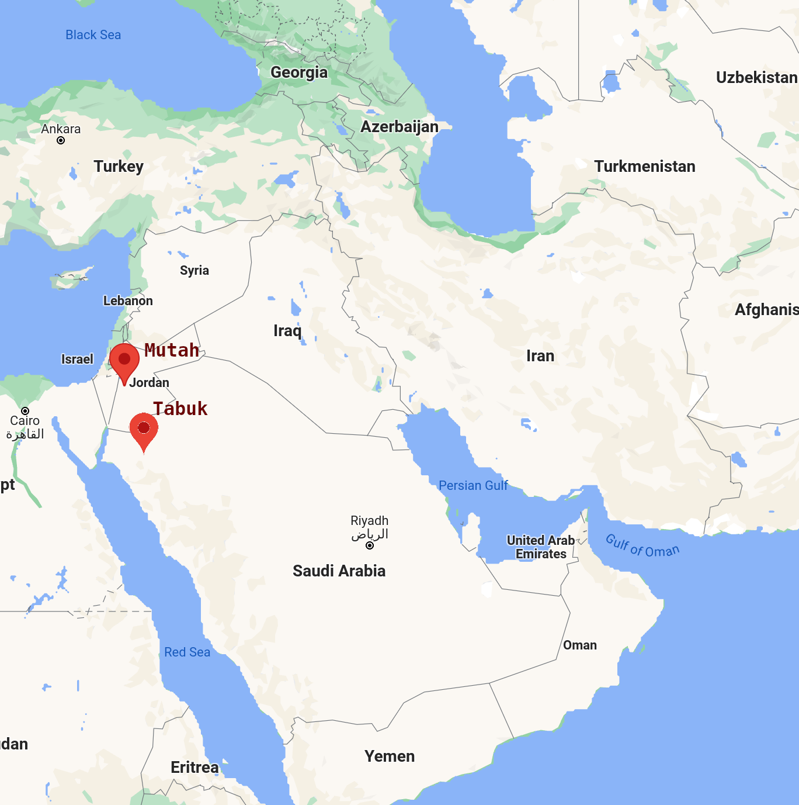

# التاريخ{#history}

## أبو بكرؓ

The Khalifa of Abu Bakrؓ was perhaps the most fragile of times for the Ummah after the prophet ﷺ passed away. This is due to the combination of a tense political climate and the two major superpowers, the Byzantines and the Sassanids, in close locale to the Muslims. However, through the genius of Abu Bakrؓ, the Muslims survived and turned from a weak, emerging nation to the greatest empire the world has ever seen.

### Election of the Khilafa

After Rasulullah ﷺ passed away, the  _ansar_  and the _muhajirun_ gather at the courtyard of _Banu Sa'idah_ to elect a leader for the Muslims. The _ansar_ wanted to nominate Sa'ad bin Ubadahؓ, who was the leader of the _khazraj_ tribe. Abu Bakr mentions the hadith that leadership is for the Quraysh. Umar ibn al-Khattabؓ nominates Abu Bakrؓ. There is consensus in the gathering and Abu Bakrؓ becomes the first Khalifa.

### The apostates

> **ردَّ** apostasy  
> **مرتاد** apostate

During the time of Rasulullah ﷺ, all of _hijaz_ was converted to Islam. Immediately after Rasulullah ﷺ passed away, many people who were only Muslim for money, politics, or other reasons began to apostate. These apostates fell into three categories:

1. Those that returned to idol worship
2. Those that followed false prophets
3. Those that claimed to be Muslim but rejected the obligation of _zakat_

Abu Bakrؓ was firm in his stance to fight all three groups. Some of these groups of people decided to not only apostatize, but also make the Muslims their enemy out of desire to control Medina or obtaining whatever wealth the Muslims had. Those in the third group, however, wanted to only be free of their financial responsibility as Muslims. Umarؓ was of the opinion that the Muslims should be lenient and not fight those in the third group. Abu Bakrؓ grabbed him by the beard and said, "Are you courageous in _jahil_ but a coward in Islam?" This highlights an important principle in Aqeedah. Every tenet of Islam is important. Any one tenet cannot be rejected.

### Early Battles

There are three basic moves Abu Bakrؓ makes:

- Send a massive army to engage the Byzantines
- Hide the women and children of Medina in a nearby mountain fort while the men prepare for battle
- Send messages to all tribes that are still Muslim to fight for the Muslims

#### The Byzantines

The apostasy of nearby tribes posed a severe risk to the young Muslim Ummah, but they were not the only challenge. The Muslims were involved with skirmishes with the Romans in the nearby Byzantine empire in the last few years of Rasulullah's ﷺ life, and once they knew he passed away they became a serious threat.

To understand the military situation of the Muslims during the time of Abu Bakrؓ, we must first review some battles that occurred during the time of Rasulullah ﷺ between the Muslims and the Byzantines.

- **7 Hijri** _Battle of Mutah_ Rasulullah ﷺ appoints Zaid bin Harithah as commander. He appoints Jafar bin Abu Talib as a second-in-command should Zaid fall, and Abdullah bin Rawahah as a third commander should Jafar fall. The appointment of backup commanders was a prophecy that they would be martyred, and indeed, all three became _shahid_. Khalid bin Waleed becomes the commander, and he brings the Muslim troops back lest they became utterly crushed by the Byzantines.
- **9 Hijri** _Battle of Tabuk_ Rasulullah ﷺ leads an army to Tabuk to engage with the Byzantines, in case of an invasion. The Byzantines were not there, and no fighting occurs.
- **11 Hijri** _Usamah bin Zaid_ Rasulullah ﷺ gathers an army under Usamah bin Zaidؓ. Before the army could leave, Rasulullah ﷺ passes away.

```{r, echo=FALSE, out.width="50%", fig.cap="location of battles against Byzantines"}

```

And thus we come to the situation of Abu Bakrؓ. He has with him an army built by the instruction of Rasulullah ﷺ. He decides to send the army with no time to spare, against the wishes of Umarؓ. From the perspective of the Byzantines, they know that the prophet of the Muslims ﷺ has passed away, yet they see a massive army approaching under Usamah bin Zainؓ. They believe this is an indication of strength from the Muslims. Typically, when a leader is no longer present, a nation will either immediately fall into disarray or will find strength through another leader. In either case, the time immediately following the loss of a leader is often one of weakness, especially for a new nation. So if a nation that just lost its prophet has the ability to send out a massive army the next week, they must possess significant strength and _hijaz_ must still be united under Islam, or so the Romans are thinking. They do not have the time to entertain the alternative possibility, i.e. that _hijaz_ is in disarray and the Muslims do not have much military might beyond the army of Usamahؓ, since to do so poses a risk of significant loss and the hedonistic Romans would not accept such a risk.

Had the Byzantines realized the betrayal by apostates in _hijaz_, no doubt they could have supported the opposing factions, instilled strife, and attempted to take advantage of the situation and ultimately circumventing Usamah's army. Instead, they fought defensively, while Usamah's army could fight offensively, amassing a large amount of wealth through the expedition and returning to Medina triumphant.

#### Battle for Medina

Meanwhile, in Medina Abu Bakr ordered the women and children to hide while the men picked up arms and hid in the Masjid and guards were stationed on the outskirts to repel attacks. In other words, the Muslims were prepared for a defensive battle in the city. Again, taking the perspective of the rebelling tribes, they believe that Medina is an easy territory for the taking. They expect a lack of unity and failing militia, but are instead met with preparedness and might.

#### Skirmishes throughout _hijaz_

## عمرؓ
