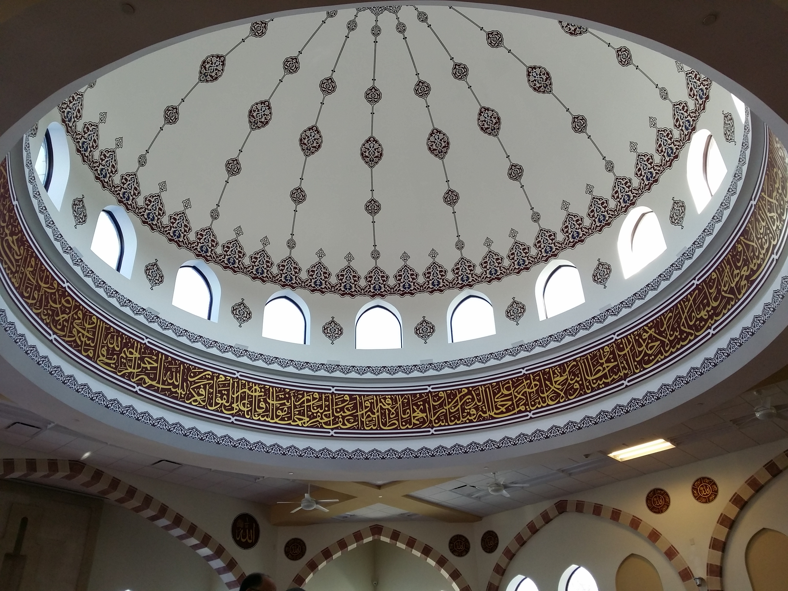

--- 
title: "Takrar"
author: "Sumeed Manzoor"
date: "last compiled on `r Sys.time()`"
site: bookdown::bookdown_site
# output: bookdown::gitbook
documentclass: book
bibliography: [book.bib, packages.bib]
biblio-style: apalike
link-citations: yes
github-repo: yoyomanzoor/takrar
description: "A collection of notes taken from tanwir classes"
favicon: images/favicon_io/favicon.ico
cover-image: images/adli-wahid-Y9bC2h5V9c8-unsplash.jpg
header-includes:
   - \usepackage{cancel}
---

```{r setup, echo=FALSE, message=FALSE, warning=FALSE}
library(ggplot2)
library(ggpubr)
library(magrittr)
library(dplyr)
library(MASS)
library(knitr)
library(kableExtra)
select <- dplyr::select
theme_set(theme_pubr())
```

# Introduction {#intro}



## Intentions{#intent}

This is a lengthy topic, and not one I can do justice to with my limited amount of knowledge and in the time I have to write this. Indeed, renewing intentions is a continuous and iterative exercise, and perhaps this sections should be similarly continuously revised. For now, I will repeat what Mufti Azeem shared on the 8/17/21 Tuesday night tafseer.  
While seeking and attaining knowledge, we should have several key intentions:

- To remove all bad desires
- We make du'a that the topic we're learning will provide solace to difficulties we are dealing with in our life
- We act on what we learn and teach it to others

## Seeking knowledge

> **العلم بلا عملٍ**  
> **كالشجرة بلا ثمرٍ**

> Knowledge without action  
> Is like the tree that doesn't bear fruit

علم is composed of two things: knowledge *and* action.

To attain علم, tarbiyya is extremely important. Imam Shafi'i narrates this poem about the advice of his teacher, Waki'i:

> شَكَوْتُ إلَى وَكِيعٍ سُوءَ حِفْظِي  
> فَأرْشَدَنِي إلَى تَرْكِ المعَاصي  
> وَأخْبَرَنِي بأَنَّ العِلْمَ نُورٌ  
> ونورُ الله لايؤتى لعاصي

> I complained to Waki' about my memory  
> He advised me to leave my sins  
> He advised me that it is because knowledge is a light  
> And the the light of Allah ﷻ does not come to a sinner

Imam Malik says:

> العلم و الحكمة نور  
> يهد الله به من يشاء  
> و ليس كثرة المسائل

> Knowledge and wisdom are light  
> that Allah ﷻ uses to guide who he wills  
> and they are not answering a lot of questions

The purpose of seeking knowledge is not to be able to answer difficult questions people ask of us, or to argue against others. It is a light that we pray guides us to find nearness to Allah ﷻ.
